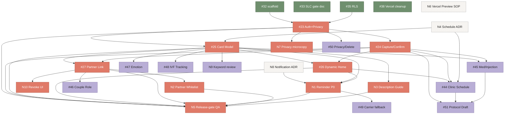

# Project Boards — Fevio [페비오]

## Purpose

GitHub Projects v2 will host kanban for issue execution. While `read:project,project` 토큰 스코프 승인이 진행되는 동안, 이 문서가 보드 설계의 source of truth다. 토큰이 발급되면 `gh project create`/`item-add`/`field-set` 호출로 그대로 옮겨진다.

이 문서는 이슈 본문을 복제하지 않는다. 대신 다음을 정의한다.

- 어느 보드가 어느 이슈를 소유하는가
- 컬럼 lifecycle과 Red/Green 규약
- 시각화 (의존성 그래프, 원문 통증 coverage matrix, status matrix, SLC release-gate burnup)

## Board overview

| # | Board | Domain | Cadence |
|---|---|---|---|
| 1 | Auth & Privacy | 인증·프라이버시 게이트·삭제·민감정보 경계 | per-PR |
| 2 | Capture & Split | 메모 입력·줄 분할·확정·프로토콜 초안 | per-PR |
| 3 | Cards & Home | 카드 모델·care day·동적 홈·일정·약/주사 | per-PR |
| 4 | Partner Coordination | 파트너 링크·노출 화이트리스트·역할 | per-PR |
| 5 | Reliability & Reminders | 알림 안전망·채널 결정 | weekly |
| 6 | Care Journey | 감정 부담·시술 회차·여정 기록 | weekly |
| 7 | Foundation & Ops | 빌드·배포·디자인 시스템·QA loop | per-PR (cross-cutting) |

Board 7은 도메인이 아니라 cross-cutting infra다. Board 1~6과 중복 라벨을 사용한다.

## Common kanban columns

```
Backlog → Ready → In Progress (Red) → Review (Green pending) → Blocked → Done
```

| Column | 들어오는 조건 | 나가는 조건 |
|---|---|---|
| Backlog | 이슈는 있으나 acceptance criteria 미합의 | 1줄 목표 + TDD 시작점 + 완료 기준 합의 |
| Ready | 합의된 이슈, 아직 미착수 | 누가 잡고 작업 시작 |
| In Progress (Red) | 작업 시작, Red evidence 코멘트 첨부 | PR 오픈 + Green evidence 코멘트 |
| Review (Green pending) | PR open, 리뷰 대기 | 리뷰 승인 + merge |
| Blocked | 외부 결정/권한/스코프 대기 | 해소 사유 코멘트 후 이전 컬럼으로 |
| Done | child Red 모두 Green 또는 명시적 out-of-scope | — |

P0 이슈는 SLC release-gate burnup 체크 갱신이 Done의 추가 조건이다.

## Custom fields per board (Projects v2 이전 시 적용)

- `Priority`: P0 / P1 / P2
- `Original-pain axis`: schedule | injection | partner | emotion | reliability | trust | protocol | ivf
- `Effort`: XS / S / M / L
- `Risk`: data | medical-boundary | ux-burden
- `TDD entry point`: 테스트 파일 경로 또는 PR 링크

## Per-board allocation

기존 이슈는 `#NN`, 신규 이슈는 `N1~N10`(상세는 `new-issues-backlog.md`).

**N1~N10 GitHub 이슈 번호 (2026-05-10 생성)**

| 코드 | GitHub | 코드 | GitHub |
|---|---|---|---|
| N1 | #52 | N6 | #57 |
| N2 | #53 | N7 | #58 |
| N3 | #54 | N8 | #59 |
| N4 | #55 | N9 | #60 |
| N5 | #56 | N10 | #61 |

### Board 1 — Auth & Privacy
- `#23` [P0] Auth + Privacy Gate
- `N7` [P0] Privacy Gate "삭제 요청 v1.x" 마이크로카피
- `#50` [P1] Privacy/Delete
- Cross-tag from Board 7: `#35` RLS (Done), `#41` Vercel ownership

### Board 2 — Capture & Split
- `#24` [P0] Capture/Confirm
- `#51` [P1] Protocol Draft
- `N9` [P1] Korean IVF keyword 확장 review 루프

### Board 3 — Cards & Home
- `N4` [ADR P0 gate] 일정 모델 ADR (선결)
- `#25` [P0] Card Model + care day 규칙
- `N3` [P0] description 콘텐츠 가이드
- `#26` [P0] Dynamic Home
- `N5` [P0] SLC release-gate manual QA 체크리스트
- `#44` [P1] Clinic Schedule
- `#45` [P1] Medication/Injection
- Cross-tag from Board 7: `#34` Design System

### Board 4 — Partner Coordination
- `#27` [P0] Partner Link
- `N2` [P0] Partner 노출 필드 화이트리스트
- `N10` [P0] Partner share link 회수 UI
- `#46` [P1] Couple Role

### Board 5 — Reliability & Reminders
- `N8` [ADR P0 gate] 알림 채널 결정 (선결)
- `N1` [P0] Reminder Minimum — in-app 강조 + email 1회
- `#49` [P1] Carrier fallback (kakao 알림톡 / SMS)

### Board 6 — Care Journey
- `#47` [P1] Emotional Load
- `#48` [P1] IVF Tracking

### Board 7 — Foundation & Ops
- `#34` [P0] 디자인 시스템 (cross-tag → Board 1~4)
- `#39` Vercel Root Directory NudgeMe 제거
- `#40` Next/PostCSS audit Red 패치 경로
- `#41` Vercel GitHub 연결 정리
- `N6` [P1] PR마다 Vercel Preview SOP

## Cross-board epics

Epics는 swimlane 또는 Project field로 분류한다.

- `#29` SLC Release Gate — Board 1~4 + Board 5 N1을 묶음
- `#43` Original-pain Expansion — Board 3~6을 묶음

## Dependency graph (blocked-by)



P0 critical path:
`#23 → (#25 ⊕ #24) → (#26 ⊕ #27) → N5`. ADR 게이트 `N4`(일정), `N8`(알림)는 P0 진입 전에 닫혀야 한다. 보정 룰 신규 P0(N1, N2, N3, N7, N10)는 부모 P0와 동일 PR 또는 직후 PR로 닫는 것을 권장한다.

## Original-pain coverage matrix

`docs/01-product/original-note-hyunjoo.md` 섹션과 그것을 해결하는 이슈/보드의 대응표. 보드 분할 후 누락이 보이면 이 표가 가장 먼저 수정된다.

| 원문 § | Pain | Issue(s) | Board | Stage |
|---|---|---|---|---|
| §1 / §5-1 | 일정 불규칙·당일 변경 | `N4` ADR → `#44` | 3 | gate → ext |
| §5-2 / 인터뷰이 A | 약 혼동·주사 누락 (시술 취소 위험) | `#25` + `N3` + `#45` + `N1` | 3, 5 | core + boost |
| §5-3 / 인터뷰이 B | 부부 정보 비대칭 (남편 직접 투여) | `#27` + `N2` + `N3` + `#46` | 4, 3 | core + boost |
| §5-4 | 시술 회차·이식·결과 기록 | `#48` | 6 | exp |
| §5-5 | 5분 이내 온보딩 | `#23` + `#26` (onboarding home) | 1, 3 | core |
| §5-6 | 알림 fallback (놓침 방지 안전망) | `N1` (P0) + `#49` (P1) | 5 | boost + ext |
| §5-7 | 데이터 민감성·접근·삭제 | `#23` + `N7` + `#50` | 1 | core + ext |
| §6-1 | 실수 방지 강화 (중요도 경고) | `#25` (#25-A 룰) + `N1` | 3, 5 | core + boost |
| §6-2 | 감정 기록·자동 공유 | `#47` | 6 | exp |
| §6-3 | 병원 프로토콜 자동 생성 | `#51` (confirmation-first) | 2 | exp |
| §6-4 | 시술 여정 타임라인 | `#48` (확장 child 별도 필요) | 6 | exp |
| §6-5 | 부부 역할 분담 | `#46` | 4 | exp |

`exp` = expansion (P1+), `core` = SLC P0, `boost` = ADR 0002 P0 보정, `gate` = 결정 ADR.

## Status matrix (snapshot 2026-05-11 KST)

GitHub issue state was checked after merging PRs #70–#73. Remaining work is concentrated in presentation polish (#74/#75), Reminder Minimum (#52), release QA (#56), and preview SOP (#57).

| Board | Backlog | Ready | In Progress | Review | Blocked | Done |
|---|--:|--:|--:|--:|--:|--:|
| 1 Auth & Privacy | 1 (#50) | 0 | 0 | 0 | 0 | 4 (#23, #35, #58, RLS baseline) |
| 2 Capture & Split | 2 (#51, #60) | 0 | 0 | 0 | 0 | 1 (#24) |
| 3 Cards & Home | 2 (#44, #45) | 1 (#56) | 0 | 0 | 0 | 5 (#25, #26, #34, #54, #55) |
| 4 Partner | 1 (#46) | 0 | 0 | 0 | 0 | 3 (#27, #53, #61) |
| 5 Reliability | 1 (#49) | 1 (#52) | 0 | 0 | 0 | 1 (#59) |
| 6 Care Journey | 2 (#47, #48) | 0 | 0 | 0 | 0 | 0 |
| 7 Foundation & Ops | 3 (#39, #40, #41) | 3 (#57, #74, #75) | 0 | 0 | 0 | 6 (#32, #33, #34, #38, #68, #69) |

Deployment interpretation:

- Real SLC lane: `ckiwon7-6820s-projects/fevio`, Supabase-backed, production alias `https://project-oznp0.vercel.app`.
- Team presentation lane: Andy-owned Vercel, backendless via `NEXT_PUBLIC_FEVIO_PRESENTATION_MODE=1`.
- Project board visualization can lag behind issue/PR truth; use GitHub issue state plus this snapshot until Projects v2 automation is available.

## SLC release-gate burnup

`docs/01-product/slc-target.md`의 release gate를 보드 단위로 분해. P0 + 보정 룰 + N5가 모두 체크되어야 SLC가 닫힌다.

- [x] Vercel URL이 모바일 viewport에서 열린다 — `#32` Done; real SLC lane verified at `https://project-oznp0.vercel.app`, Andy presentation lane uses backendless mode
- [x] Google OAuth 로그인 시작 경로가 Supabase authorize로 연결됨 — `#23` Done; Supabase Google OAuth configured, full human login QA remains in `#56`
- [x] Privacy Gate 미수락 시 sensitive write 차단 — `#23`
- [x] Privacy Gate 안내에 "삭제 요청 v1.x" 명시 — `#58`
- [x] 첫 로그인/첫 캡처 전 홈 규칙이 `onboarding`을 지원 — `#26`; full manual QA remains in `#56`
- [x] Capture CTA가 `visit_inputs`+`action_split_drafts`만 저장 — `#24`
- [x] Classification 버튼 클릭이 DB write를 발생시키지 않음 — `#24`
- [x] Confirm transaction이 `split_candidates`+`care_action_cards` 생성 + `first_capture_completed_at` 1회 — `#24`
- [x] Dynamic Home이 onboarding → care day로 전환 — `#26`
- [x] Supabase RLS/schema baseline and auth boundary tests 통과 — `#23` + `#35`
- [x] Partner share link sanitized — `#27` + `#53`
- [x] [BOOST] Critical injection 카드가 임박 시 in-app 시각·텍스트 강조 — `#25` + `#26`
- [x] [BOOST] Partner description 가이드와 행동 단서 보강 — `#54`; whitelist done in `#53`
- [ ] [BOOST] Email 1회 리마인드 동작 — `#52`; ADR `#59` Done
- [ ] SLC manual QA checklist all green — `#56`
- [x] 일정 모델 ADR 결정 — `#55`
- [x] 알림 채널 ADR 결정 — `#59`

Presentation readiness add-ons before final QA:

- [ ] iOS-style fixed mobile frame on desktop/tablet — `#74`
- [ ] Fevio logo/app icon/OG brand identity wired into metadata/assets — `#75`

## Migration to GitHub Projects v2

권한 발급 후 1회 실행으로 보드를 만들어낼 수 있게 설계되어 있다.

```
gh auth refresh -s read:project,project
# 이후
bash docs/03-engineering/scripts/create-boards.sh
```

`create-boards.sh`(추후 작성)가 수행할 일:

1. `Andy-Lee0920` 소유로 v2 project 7개 생성 (이름 = 본 문서 Board #와 일치).
2. 각 보드에 컬럼 6개 + 위 custom fields 추가.
3. 각 이슈를 본 문서 allocation에 따라 add.
4. Priority/Axis/Effort/Risk/TDD entry point 필드값 설정.
5. Epic `#29`/`#43`을 cross-board reference field로 연결.

스크립트가 추가되기 전에는, 이 문서를 보고 GitHub UI에서 수동 생성도 가능하다.

## Review rules

- 보드는 이 문서를 따른다. 보드가 바뀌면 이 문서가 먼저 바뀐다.
- 새 이슈는 정확히 한 보드에 owner로 들어가고, 필요 시 라벨로 cross-tag한다.
- P0 이슈를 close할 때 SLC release-gate burnup 체크가 갱신되었는지 확인한다.
- 비개발자 contributor도 이 문서로 보드 의도를 이해할 수 있어야 한다 (`docs/03-engineering/issue-writing-rules.md`와 동일 원칙).

## 연결 문서

- Source of pain: `docs/01-product/original-note-hyunjoo.md`
- Release gate: `docs/01-product/slc-target.md`
- Implementation PRD: `docs/01-product/prd-v1.0.md`
- Issue writing rules: `docs/03-engineering/issue-writing-rules.md`
- TDD issue map: `docs/03-engineering/slc-tdd-issue-map.md`
- ADR 0001 — SLC-first, manual-first: `docs/04-decisions/0001-slc-first-manual-first.md`
- ADR 0002 — P0 boost rules: `docs/04-decisions/0002-p0-boost-rules.md`
- New issue backlog: `docs/03-engineering/new-issues-backlog.md`
