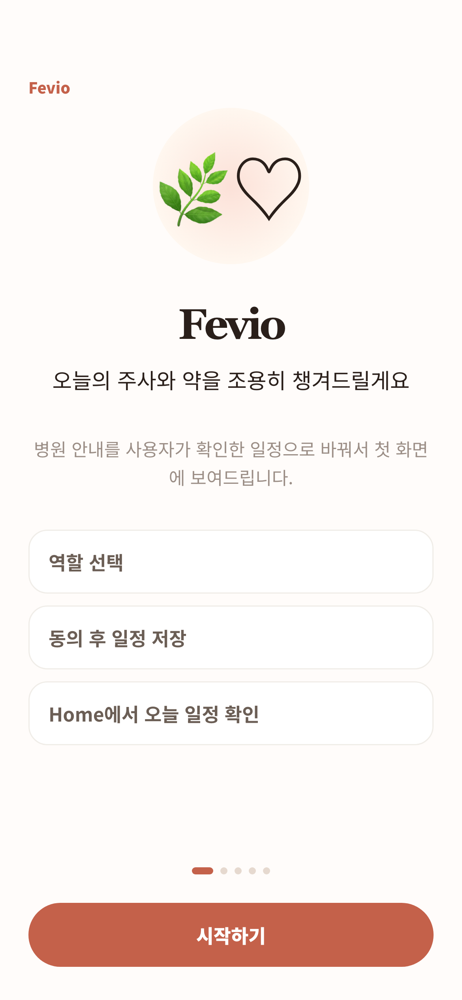
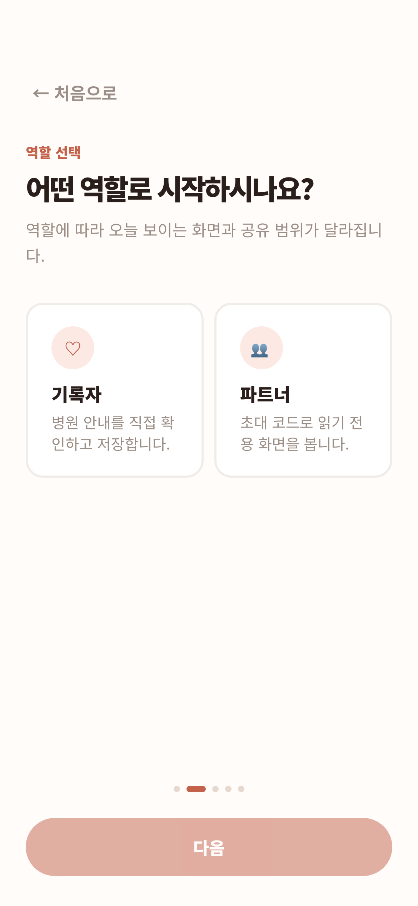
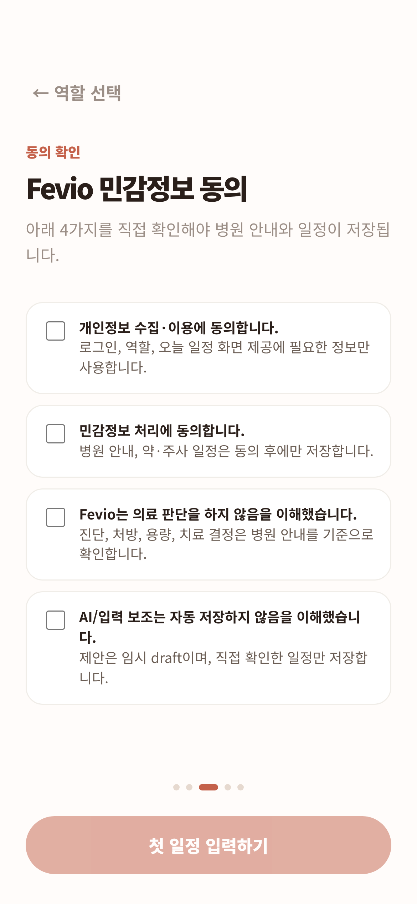
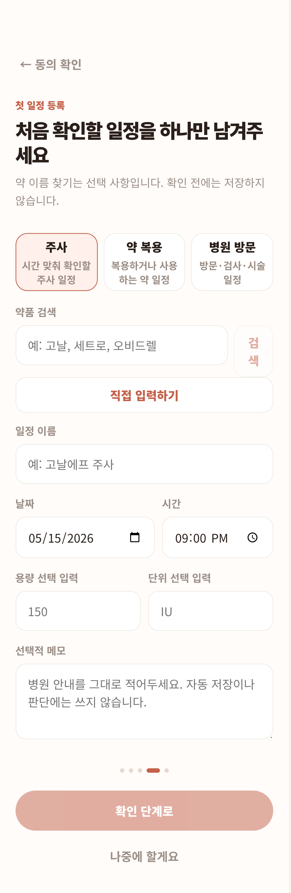
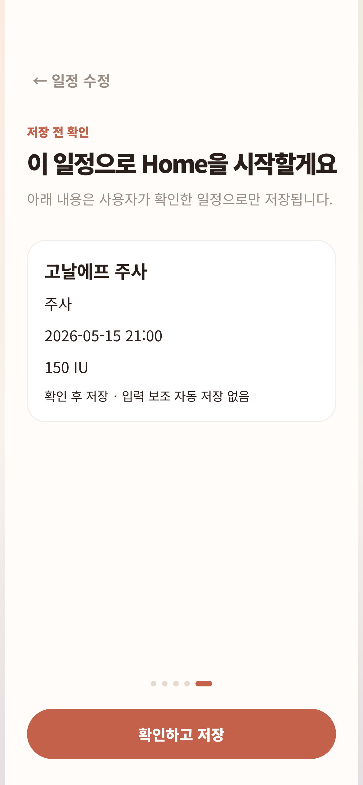
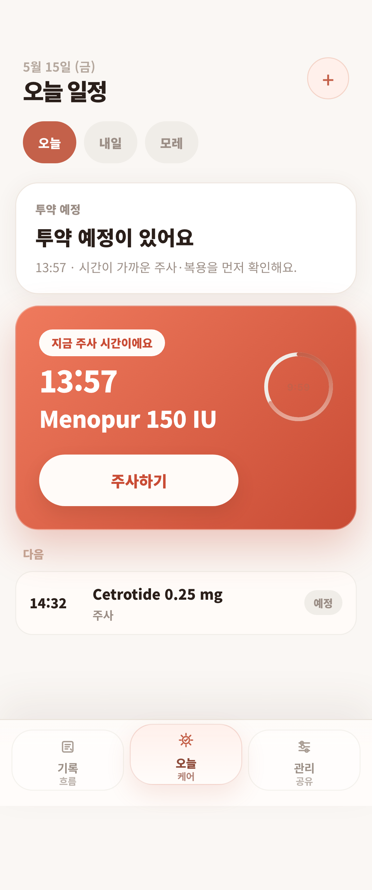
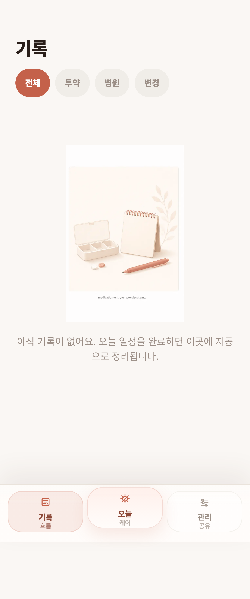
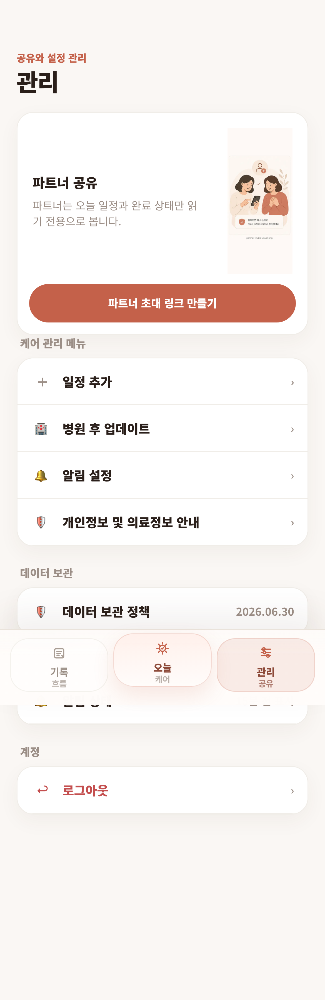
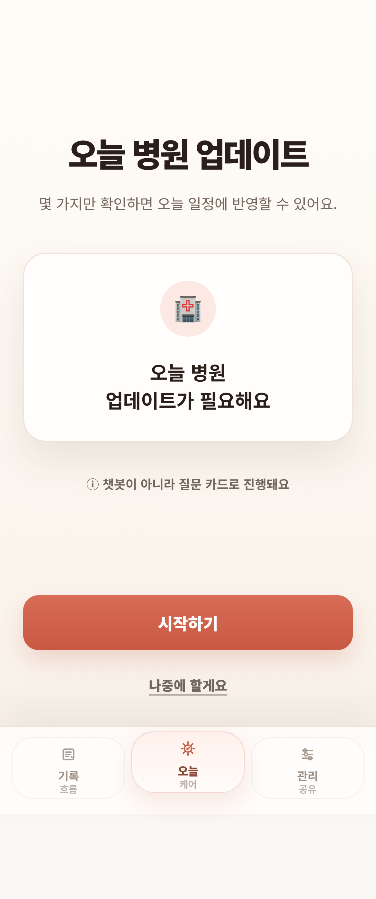
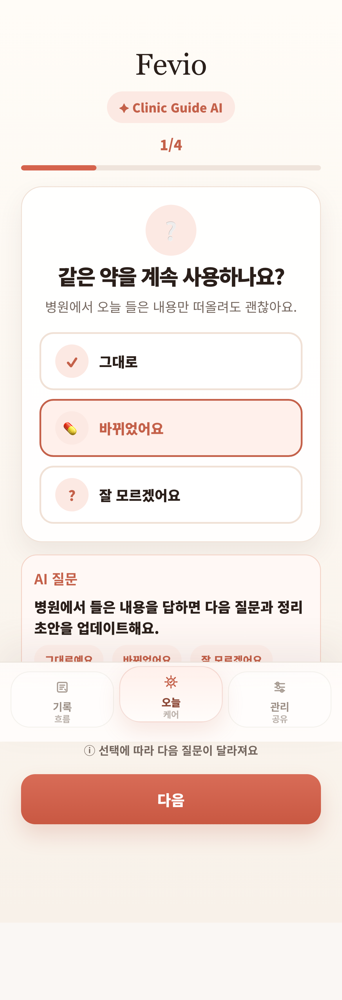

# Mobile Visual QA Evidence — 2026-05-15

## Scope

- Viewport: iPhone-style 390×844, DPR 3, mobile + touch enabled.
- Build mode: local production build with `NEXT_PUBLIC_FEVIO_PRESENTATION_MODE=1`.
- Production deploy evidence is tracked separately for `https://project-oznp0.vercel.app/`; protected production routes need an authenticated session, so this report captures production-equivalent presentation-mode screens for visual review.

## Screenshots and measurements

| Screen | Route | Screenshot | Horizontal overflow | Min visible target height | Sampled controls below 44px | Text sample |
| --- | --- | --- | --- | --- | --- | --- |
| 00-onboarding-intro | `/onboarding` |  | pass | 54px | none in sampled controls | Fevio 🌿♡ Fevio 오늘의 주사와 약을 조용히 챙겨드릴게요 병원 안내를 사용자가 확인한 일정으로 바꿔서 첫 화면에 보여드립니다. 역할 선택 동의 후 일정 저장 Home에서 오늘 일정 확인 시작하기 |
| 01-onboarding-role-selection | `/onboarding` |  | pass | 44px | none in sampled controls | ← 처음으로 역할 선택 어떤 역할로 시작하시나요? 역할에 따라 오늘 보이는 화면과 공유 범위가 달라집니다. ♡ 기록자 병원 안내를 직접 확인하고 저장합니다. 👥 파트너 초대 코드로 읽기 전용 화면을 봅니다. 다음 |
| 02-onboarding-consent | `/onboarding` |  | pass | 44px | none in sampled controls | ← 역할 선택 동의 확인 Fevio 민감정보 동의 아래 4가지를 직접 확인해야 병원 안내와 일정이 저장됩니다. 개인정보 수집·이용에 동의합니다. 로그인, 역할, 오늘 일정 화면 제공에 필요한 정보만 사용합니다. 민감정보 처리에 동의합니다. 병원 안내, |
| 03-first-schedule-interview | `/onboarding` |  | pass | 44px | none in sampled controls | ← 동의 확인 첫 일정 등록 처음 확인할 일정을 하나만 남겨주세요 약 이름 찾기는 선택 사항입니다. 확인 전에는 저장하지 않습니다. 주사 시간 맞춰 확인할 주사 일정 약 복용 복용하거나 사용하는 약 일정 병원 방문 방문·검사·시술 일정 약품 검색 검색 |
| 04-first-schedule-confirm | `/onboarding` |  | pass | 44px | none in sampled controls | ← 일정 수정 저장 전 확인 이 일정으로 Home을 시작할게요 아래 내용은 사용자가 확인한 일정으로만 저장됩니다. 고날에프 주사 주사 2026-05-15 21:00 150 IU 확인 후 저장 · 입력 보조 자동 저장 없음 확인하고 저장 |
| 05-home | `/home` |  | pass | 44px | none in sampled controls | 5월 15일 (금) 오늘 일정 + 오늘 내일 모레 투약 예정 투약 예정이 있어요 13:57 · 시간이 가까운 주사·복용을 먼저 확인해요. 9:59 지금 주사 시간이에요 13:57 Menopur 150 IU 주사하기 다음 14:32 Cetrotide 0 |
| 06-records | `/records` |  | pass | 44px | none in sampled controls | 기록 전체 투약 병원 변경 아직 기록이 없어요. 오늘 일정을 완료하면 이곳에 자동으로 정리됩니다. 기록 흐름 오늘 케어 관리 공유 |
| 07-more | `/more` |  | pass | 46px | none in sampled controls | 공유와 설정 관리 관리 파트너 공유 파트너는 오늘 일정과 완료 상태만 읽기 전용으로 봅니다. 파트너 초대 링크 만들기 케어 관리 메뉴 ＋ 일정 추가 › 🏥 병원 후 업데이트 › 🔔 알림 설정 › 🛡 개인정보 및 의료정보 안내 › 데이터 보관 🛡 |
| 08-clinic-update-entry | `/clinic-update` |  | pass | 44px | none in sampled controls | 오늘 병원 업데이트 몇 가지만 확인하면 오늘 일정에 반영할 수 있어요. 🏥 오늘 병원 업데이트가 필요해요 ⓘ 챗봇이 아니라 질문 카드로 진행돼요 시작하기 나중에 할게요 기록 흐름 오늘 케어 관리 공유 |
| 09-clinic-update-interview | `/clinic-update` |  | pass | 57px | none in sampled controls | Fevio ✦ Clinic Guide AI 1/4 ❔ 같은 약을 계속 사용하나요? 병원에서 오늘 들은 내용만 떠올려도 괜찮아요. ✓ 그대로 💊 바뀌었어요 ? 잘 모르겠어요 AI 질문 병원에서 들은 내용을 답하면 다음 질문과 정리 초안을 업데이트해요. |

## Result

- Horizontal overflow: pass.
- Touch target sample: pass in sampled controls.
- Evidence caveat: screenshots are deterministic artifact evidence from the same code path, not a logged-in production account capture.
